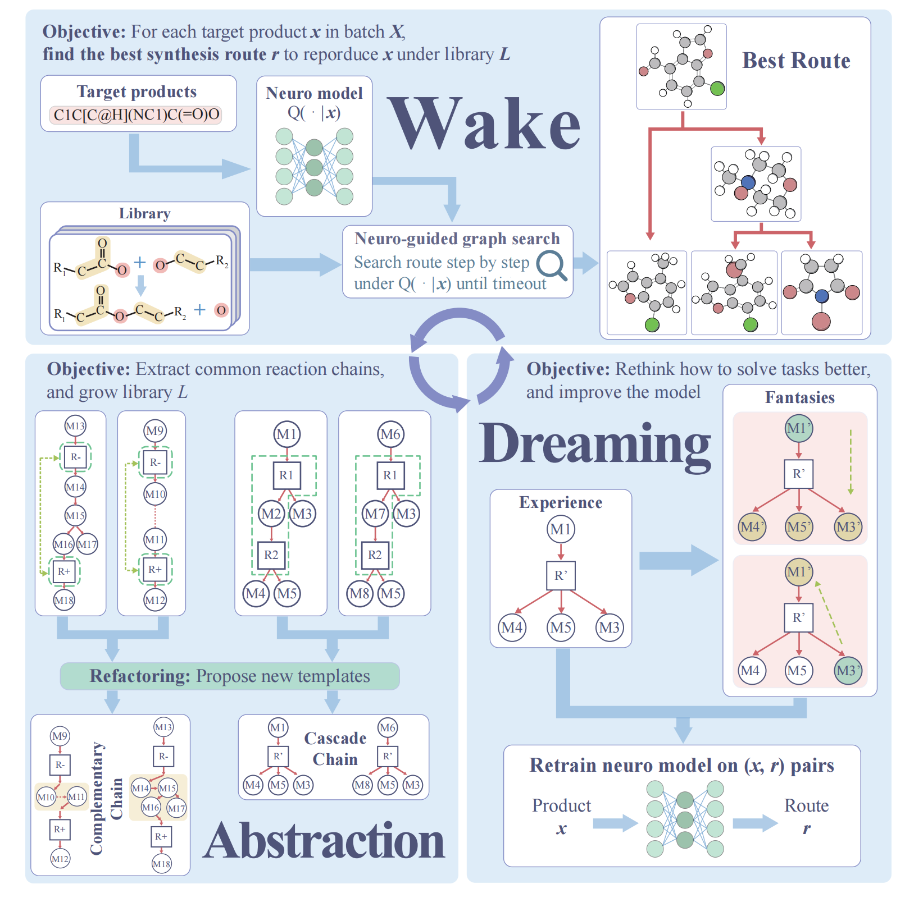

# Group Retrosynthetic Planning As Neurosymbolic Programming

## About
This directory contains the code and resources of the following paper:

<i>"Group retrosynthetic planning as neurosymbolic programming". Under review. </i>

1. Our system is a framework to solve retrosynthetic planning tasks.
2. Our experimental results are based on Retro-190 dataset used in  https://github.com/binghong-ml/retro_star.
3. Please contact Xuefeng Zhang osu_zxf@stu.pku.edu.cn if you have issues using this software.

## Overview of the Model
Our system can be divided into three phases that alternate continuously. In the wake phase, an AND-OR search graph is constructed in the process of retrosynthetic planning. Starting from the target molecule, two neural network models are adopted to guide the planning process to approach the purchasable molecule set more rapidly; one model helps choose where to expand the graph, and the other model guides how to expand the graph at a specified point. When the search terminates, we gather successfully solved synthesis pathways and failed molecules for which no synthesis pathway was found for later use in the other two phases. The abstraction phase mainly focuses on how to expand a node, and the goal is to go beyond existing fundamental rules and discover compositional strategies that are more suitable for retrosynthesis in the future. Here, we introduce two types of structures in the search graph that represent multi-step reaction processes: “cascade chains” for cascade reactions and “complementary chains” for complementary reactions. The most useful strategies are filtered out, defined as abstract reaction rules, and then added to the library. Apparently, a diverse set of strategies can enhance the performance to address various retrosynthesis problems effectively. However, the increase in the library also brings about more branches, thereby complicating the selection difficulty during expansion. Therefore, the dreaming phase mainly focuses on how to refine the neural models. In this phase, we generate a substantial amount of retrosynthetic data, called fantasies, by simulating retrosynthesis experiences from both bottom-up and top-down approaches, to address the data-hungry problem of the machine learning model. We then refine the two models mentioned before using both replayed experiences and fantasies to improve their performance in the subsequent wake phase.

<p align="center">
 
</p>


### Step 1. Setup the environment
We recommend to create a conda virtual environment
```
conda env create -f src/environment.yml
conda activate dream_retro
```

(Optional) If you found install from file slow, maybe you can install them step by step.
```
conda create -n dream_retro2 python=3.7
conda activate dream_retro2
conda install pandas networkx graphviz python-graphviz tqdm
conda install rdkit -c rdkit
conda install pytorch torchvision cpuonly -c pytorch
```

### Step 2. Download the data
Download the building block set, pretrained one-step retrosynthetic model, reaction templates library extracted from USPTO, retrosynthetic tasks and solutions from [link](https://drive.google.com/drive/folders/1nXAuiBzb5YqcIJ5zeP0IoJFt0F5s7Flp?usp=sharing).

After downloading the files, 
- Put **origin_dict.csv** under the src/dreamretroer/dataset directory,
- Put **retro_star_value.ckpt**, **template_rules.dat** under the src/dreamretroer/one_step_model directory.
 

### Step 3. Install rdchiral and template selection lib
```
pip install -e src/packages/mlp_retrosyn
pip install -e src/packages/rdchiral

pip install -e src/
```

### Step 4. Run retrosynthetic planning
To solve retrosynthetic task, run the following command to run an example,

```
cd src/
python api.py
```

For further details, see Online Methods of our paper. 
